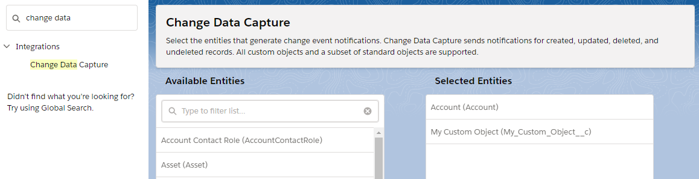
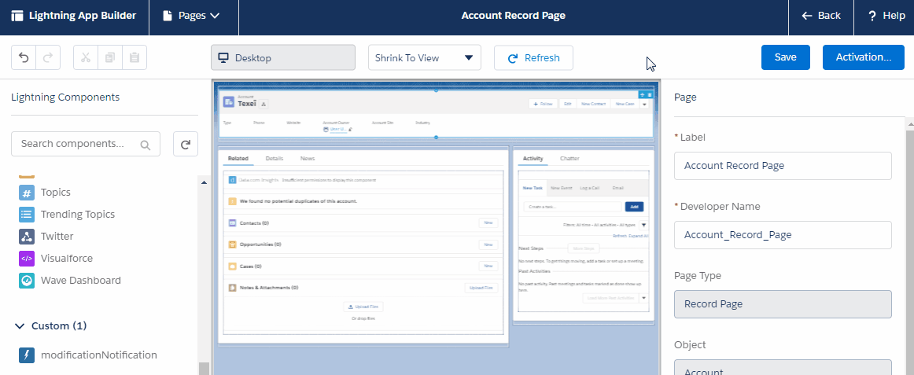
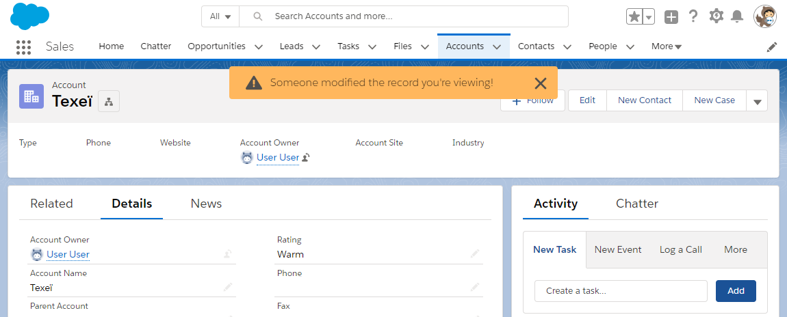

# Modification Notification

Demo component that notifies a user when a record is modified by someone else.    
It makes use of Winter '19 Change Data Capture and `lightning:empApi` component.

### How to use it

Activate Change Data Capture for the objects you want to track:

Add the component to the record page in App Builder:

That's it, you'll get notified when someone else modifies the record you're viewing:

