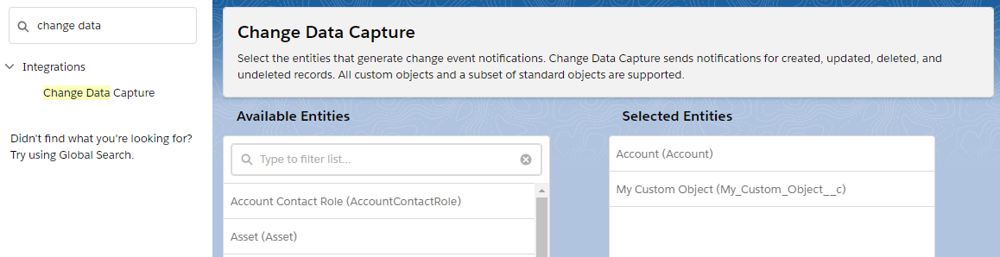
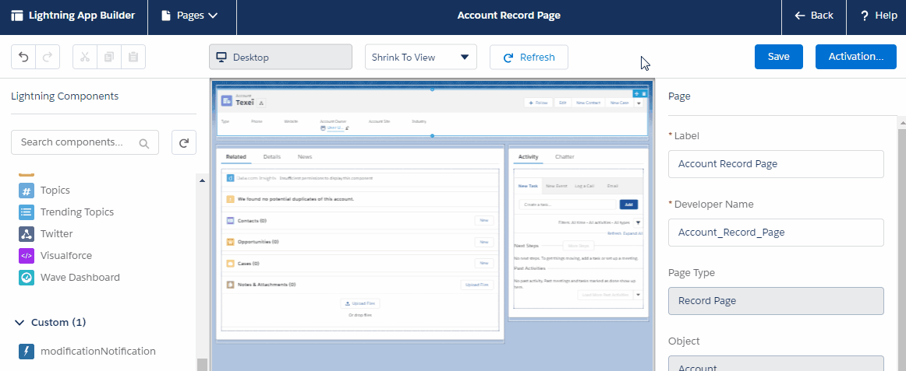
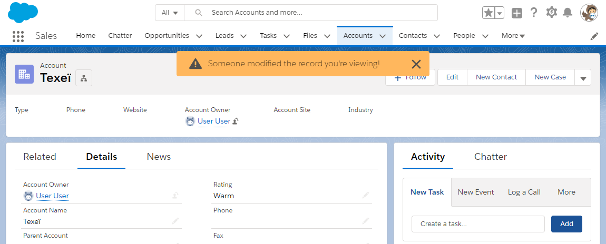

# Modification Notification

⚠️ DO NOT USE THIS DEMO IN PRODUCTION ⚠️

This component is linked to [this blog post](https://texei.com/en/advices/get-live-notifications-when-the-record-youre-viewing-gets-modified/) and was used as a technical demo in 2018 when these features were still in Beta and that neither limits nor pricing were available. **Do not use it in Production**.

---

Demo component that notifies a user when a record is modified by someone else.    
It makes use of Winter '19 Change Data Capture and `lightning:empApi` component.

### How to use it

Activate Change Data Capture for the objects you want to track:

Add the component to the record page in App Builder:

That's it, you'll get notified when someone else modifies the record you're viewing:

